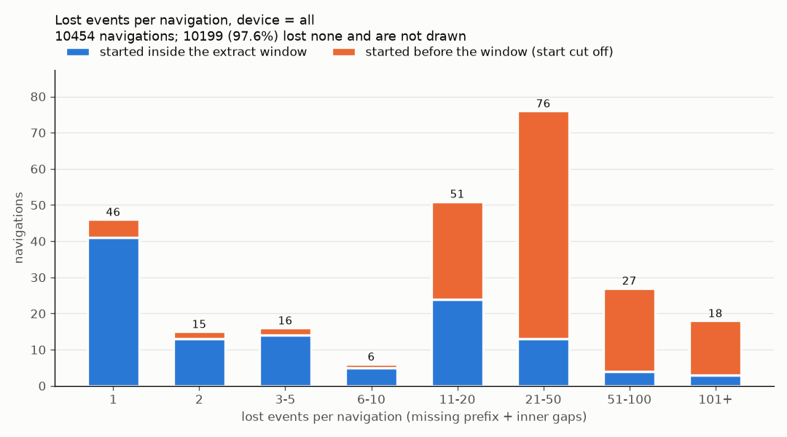

# Search navigation event monitoring

A data-engineering take-home task: monitoring the completeness of user
events collected for search *navigations* (a search query and everything
the user does on the results page until they leave or search again),
implemented in Apache Spark (PySpark).

The raw data (`*.json.bz2`) belongs to the company that set the task and is
**not** part of this repository; place the five files in `data/` to run the
code.

## Results at a glance

All five tasks are solved. Every number below is in `results/`.

| Task | Definition (short) | all | phone | desktop | tablet |
|---|---|---:|---:|---:|---:|
| navigations in scope | at least one client event | 10 454 | 4 690 | 4 585 | 394 |
| 1. incomplete navigations | a lost client event (prefix or inner gap) | 255 (2.4 %) | 61 (1.3 %) | 27 (0.6 %) | 5 (1.3 %) |
| 2. not starting from zero | lowest received `serialId` > 0 | 163 | 3 | 1 | 0 |
| 3. lost events in total | missing prefix + inner gaps, summed | 9 052 | 360 | 281 | 42 |
| 4. most common last event | type at the highest `serialId` | mouse-down 64.0 % | mouse-down 53.9 % | mouse-down 79.2 % | mouse-down 55.1 % |
| 5. most frequent event type | deduplicated event count | box-change 78.2 % | box-change 77.5 % | box-change 80.1 % | box-change 80.3 % |

`all` is more than the sum of the devices: it also holds 785 navigations
without a request row, whose device is unknown.

The most important finding: **most of the apparent loss is an artefact of
how the extract was cut, not loss in delivery.** The extract is one hour of
`eventTime` (21:00-22:00 UTC). A navigation that began before 21:00 lost its
request and its first events to the cut. 138 of the 163 navigations that do
not start from serial 0 provably began before the window, and they carry
7 299 of the 9 052 lost events. Navigations with a known device lose far
less: 0.6-1.3 % of them have any gap.

## How to run

```sh
uv venv .venv && uv pip install --python .venv/bin/python -r requirements.txt
export JAVA_HOME=/usr/lib/jvm/java-21-openjdk-amd64   # Spark 4 runs on Java 17/21, not 25

# all five tasks for one device setting, written to results/<device>/
.venv/bin/python -m navigation --data-dir data --device all --out results/all
.venv/bin/python -m navigation --data-dir data --device phone --out results/phone   # desktop, tablet alike

# the data profile behind the definitions below
.venv/bin/python -m navigation.profile --data-dir data --out results/data_profile.json

# tests: hand-built DataFrames on a local Spark
.venv/bin/python -m pytest -q
```

Each `results/<device>/` holds:

| File | Content |
|---|---|
| `task1_incomplete_navigations.csv` | one row per incomplete navigation, with the loss split into prefix and inner gaps |
| `task2_not_starting_from_zero.csv` | one row per navigation whose first received serial is > 0 |
| `task3_lost_events_histogram.csv` / `.png` | navigations per exact number of lost events (CSV), bucketed chart (PNG) |
| `task4_last_event_types.csv` | distribution of the last event's type, ranked |
| `task5_event_type_frequency.csv` | event types by frequency, ranked, with two per-navigation readings |
| `summary.json` | the headline numbers of the run |

`results/data_profile.json` is device-independent: it is the evidence every
"the data shows" statement below is quoted from.

| Module | Responsibility |
|---|---|
| `navigation/schemas.py` | explicit schemas of the five files |
| `navigation/loader.py` | read, union the four client streams, attach the device, device filter |
| `navigation/tasks.py` | the per-navigation summary and one function per task |
| `navigation/__main__.py` | the CLI: filter once, run every task, write the outputs |
| `navigation/output.py` | CSV and JSON writing, the histogram chart |
| `navigation/profile.py` | the data profile |

## What the data contains

The description is incomplete in several places, so the files were profiled
in full before any definition was written.

* **The id is `navigation`**, not `navigationId`. **There is no
  `navigationTime` field** in any file.
* **`request`** (9 669 rows) has `eventTime`, `hwType` (phone 4 690,
  desktop 4 585, tablet 394) and `navigation`: exactly one row per
  navigation and **no `serialId`**.
* **The four client files** (389 417 rows) share `navigation`, `serialId`,
  `relativeTimeMs` and `eventTime`. Their payloads differ, and include a
  `clientSize` the description does not mention.
* **The extract is one hour of `eventTime`.** Requests arrive from 21:00:00.9
  to 21:59:58.8 and client events from 21:00:00.0 to 21:59:59.9, all on
  2022-05-11 UTC.

### Answers to the key questions

**Does `serialId` start at 0 or 1? Is the request part of the sequence?**
It starts at **0**. 10 291 of the 10 454 navigations have a serial 0, and
all 10 293 serial-0 rows are `page-change` events carrying `clientSize`, the
viewport size: the initial render of the results page. Serial 0 is not an
event type missing from the dataset. The request has no `serialId`, so it is
a **separate, server-side event outside the serial sequence**. It still
belongs to the navigation, which starts with the search.

**What is a lost event?** A serial that must have existed but never
arrived: the **missing prefix** (serials `0 .. first-1`) plus the **inner
gaps** (holes in `[first, last]`). Because serials start at 0, that is
`lost = last_serial_id + 1 - distinct serials received`. Counting distinct
serials matters: a re-delivered event must not fill a hole.

**Can loss at the end be detected?** No. The data has no end marker and no
"events sent" counter, so a navigation that lost its last three events looks
complete. Every lost-event number here is a **lower bound**.

**Duplicates.** 85 `(navigation, serialId)` pairs arrive twice, in only 8
navigations (phone 71, tablet 14, desktop 0). Every copy has the same type
and the same payload as its original; only `eventTime` differs, by 0.04 to
30 s. They are client re-deliveries, not separate events. They are **counted
once** in every task and are never lost events. They are reported as their
own signal: a `duplicate_events` column in task 1 and totals in
`summary.json`.

**Which ordering defines the last event?** The highest `serialId`, the
client's own order. `relativeTimeMs` never decreases as `serialId` grows,
so the two agree, but `relativeTimeMs` **ties at the maximum in 1 061
navigations** (5 of them between two types). Those ties need a tie-breaker,
and the only sensible one is `serialId` itself. `eventTime` is arrival time:
it goes backwards against `serialId` 21 813 times, in 9 606 of the 10 454
navigations, because the browser sends events in batches. **The choice does
not change the winner but does change the rest**: by arrival, mouse-down
still ends most navigations (6 446 against 6 691), but page-change moves to
second place (2 063 against 871), and the type differs in 1 336 navigations.
Late page-change arrivals are presumably flushed when the page is hidden or
unloaded.

**How is the device attached?** Only the server knows it. It reaches client
events through a **left join on `navigation`** with `request.hwType`; the
request side is small and broadcast. **785 navigations (7.5 %, 23 568
events) have client events but no request row.** An inner join would drop
them silently, together with most of the loss in the data. They are kept
with `hw_type = "unknown"`: they count under `--device all` and under no
concrete device. No request lacks client events.

**Where does the extract window cut navigations?** An event happens
`relativeTimeMs` after its navigation starts and can only arrive after it
happens, so `eventTime - relativeTimeMs` of any event is an upper bound of
the navigation's start. If the smallest bound is before 21:00, the
navigation provably began before the window, and its missing start was cut
off by the extract rather than lost in delivery. That is the
`started_before_window` column. The bound is tight: for navigations with a
request it lies 27 ms before the request's arrival at the median. The window
start is the hour of the earliest `eventTime`, not the earliest arrival
itself, which would shift with the device filter.

## The tasks

`tasks.navigation_summary` holds the shared definitions in one
`groupBy("navigation")`: first and last serial, received events, duplicates,
missing prefix, inner gaps, lost events, first and last event type and the
window flag. Tasks 1-4 build on it. The device filter is applied once, on
the events, before any task; `hw_type` is constant within a navigation, so a
navigation is kept or dropped whole.

### 1. Incomplete navigations (`incomplete_navigations`)

**Definition.** A navigation is incomplete when at least one of its client
events is detectably lost: `lost_events > 0`, a missing prefix or an inner
gap. A short navigation is not incomplete, and neither is one with
duplicates only.

**Why.** It is the same measure as task 3, so the non-zero bars of the
histogram are exactly the task 1 list. A missing request row is a different
failure on a different (server-side) path, and since the device comes from
the request, such a navigation can only ever appear under `all`: counting it
here would make `all` (8.4 %) and every device (at most 1.3 %) measure
different things. It is reported instead (`has_request` column,
`navigations_without_request` in `summary.json`, observation 1).

| | all | phone | desktop | tablet | unknown |
|---|---:|---:|---:|---:|---:|
| incomplete navigations | 255 (2.4 %) | 61 (1.3 %) | 27 (0.6 %) | 5 (1.3 %) | 162 (20.6 %) |
| ... with an inner gap only | 92 | 58 | 26 | 5 | 3 |
| ... started before the window | 138 | 0 | 0 | 0 | 138 |

For known devices the problem is almost always an inner gap, and phones lose
events about twice as often as desktops.

### 2. Navigations not starting from zero (`navigations_not_starting_from_zero`)

**Definition.** The lowest received `serialId` is > 0. Serial 0 exists in
the data, so "from zero" is taken literally. This is the prefix-loss slice
of task 1.

**Result.** 163 navigations under `all`: phone 3, desktop 1, tablet 0,
unknown 159.

| first serial > 0 | navigations | lost events |
|---|---:|---:|
| no request, began before the window (start cut off by the extract) | 138 | 7 299 |
| no request, not provably before the window | 21 | 1 051 |
| with a request (start genuinely lost) | 4 | 118 |

So this is overwhelmingly an **extract-boundary effect**. Only 4
navigations, all with a known device, truly lost their start; navigation
2819, for example, received a single event, serial 1. The CSV carries
`has_request`, `implied_start` and `started_before_window`, so the cases can
be filtered apart.

### 3. Histogram of lost events (`lost_events_histogram`)

**Definition.** `lost_events` from task 1, for **every** navigation,
including the zero bucket: the share of complete navigations is the
headline. Duplicates are not losses, trailing losses are invisible.

**Output.** The CSV has exact counts, one row per distinct `lost_events`
value, with a `navigations_started_before_window` column. The PNG buckets the
long tail (1, 2, 3-5, ..., 101+), stacks each bucket by window start, and
states the zero bucket in its title instead of drawing a bar over 100
times taller than the rest.

| | all | phone | desktop | tablet |
|---|---:|---:|---:|---:|
| navigations with 0 lost | 10 199 (97.6 %) | 4 629 (98.7 %) | 4 558 (99.4 %) | 389 (98.7 %) |
| navigations with ≥ 1 lost | 255 | 61 | 27 | 5 |
| lost events | 9 052 | 360 | 281 | 42 |
| ... from missing prefixes | 8 466 | 97 | 21 | 0 |
| ... from inner gaps | 586 | 263 | 260 | 42 |
| max in one navigation | 733 | 77 | 27 | 19 |



The pre-window part (orange) dominates every bucket from 11 lost events up.
Inside the window the shape is bimodal. The 97 inner gaps, as runs of
consecutive missing serials, are mostly a single event (46 runs), but 23
runs are 12 to 42 serials long. Those look like **whole batches lost**, a
failed send rather than a dropped event, and need a different fix.

### 4. The event a navigation most often ends with (`last_event_types`)

**Definition.** The type of the event with the highest received `serialId`
(the ordering question is answered above). The output is the whole ranked
distribution; `rank = 1` is the answer, and equal counts share a rank.

| last event | all | phone | desktop | tablet | unknown |
|---|---:|---:|---:|---:|---:|
| **mouse-down** | **6 691 (64.0 %)** | **2 527 (53.9 %)** | **3 631 (79.2 %)** | **217 (55.1 %)** | 316 |
| box-change | 2 815 (26.9 %) | 1 622 (34.6 %) | 736 (16.1 %) | 151 (38.3 %) | 306 |
| page-change | 871 (8.3 %) | 504 (10.7 %) | 207 (4.5 %) | 21 (5.3 %) | 139 |
| box-create | 77 (0.7 %) | 37 (0.8 %) | 11 (0.2 %) | 5 (1.3 %) | 24 |

This fits the definition of a navigation, which ends with a click leading
away from search. Ending on a box-change is twice as common on touch devices
(35-38 %) as on desktop (16 %): presumably a scroll followed by closing the
tab or switching apps, which leaves no click. The caveat is that this is the
last *received* event. 155 navigations have their last arrival in the
window's final minute and may simply be cut off there.

### 5. The most frequent event type (`event_type_frequency`)

**Definition.** Event types ranked by the number of events, where an event
is a distinct `(navigation, serialId)`, so re-deliveries count once. Two
navigation-level readings of "most frequent in navigations" are extra
columns and give the same winner: in how many navigations the type occurs,
and in how many it is the most frequent type (a tie credits every tied
type). The request is not counted: it is outside the client stream and
occurs once per navigation, so it could never lead.

| type | events (all) | share all | phone | desktop | tablet | most frequent type in (all) |
|---|---:|---:|---:|---:|---:|---:|
| **box-change** | 304 634 | **78.2 %** | **77.5 %** | **80.1 %** | **80.3 %** | 9 857 navigations |
| page-change | 40 576 | 10.4 % | 10.5 % | 10.3 % | 7.1 % | 474 |
| box-create | 32 457 | 8.3 % | 9.0 % | 6.5 % | 10.1 % | 177 |
| mouse-down | 11 665 | 3.0 % | 3.0 % | 3.1 % | 2.5 % | 81 |

box-change (a tracked result box changing position, size or visibility
while the user scrolls) leads in every reading and on every device, at about
29 per navigation. It is the volume driver of the whole pipeline.

## Data-quality observations

1. **7.5 % of navigations have no request row**, and the window explains
   only part of it. 143 of the 785 began before 21:00. The other 642 are
   not provably before the window, and 621 of them even have their serial 0
   and lose only 19 events in total, yet their request is not in the
   extract. That points at request loss or an upstream filter on `request`.
   Because the device comes only from the request, **these navigations are
   invisible to every device-filtered report**. Sending `hwType` with the
   client events would remove that dependency.
2. **Prefix loss is almost entirely a boundary artefact.** Only 4
   navigations with a request miss serial 0. Hourly processing will always
   report false losses at the start of each hour and hide real ones at its
   end.
3. **Duplicates come in bursts.** The 85 duplicated serials sit in 8
   navigations, and the copies are identical apart from `eventTime`. That
   is consistent with a client re-sending a batch whose acknowledgement it
   did not get (at-least-once delivery). Desktop has none.
4. **`eventTime` is not an ordering key within a navigation.** It goes
   backwards against `serialId` in 92 % of the navigations. Anything that
   sessionises or orders events must use `serialId` (or `relativeTimeMs`),
   not arrival time.
5. **Booleans are sent only when true, sometimes.**
   `mouse-down.activeElement` is `true` (10 550) or absent (1 122), never
   `false`, so it is a presence flag and a reader treating null as "unknown"
   would be wrong. `box-change.visibility` does carry `false` (91 853) and
   is absent on 207 rows.
6. **Partial payloads are normal.** 28 % of box-change rows lack
   `relativePosition` and 32 % lack `relativeSize`, presumably because only
   changed attributes are sent. `clientSize` is on every serial-0
   `page-change` and on 1 647 later ones (resizes). `relativeLayoutSize`
   uses `-1` as a sentinel. A field-completeness monitor has to know which
   absences are by design.
7. **Navigations live long.** `relativeTimeMs` reaches 41 592 338 ms
   (11.6 h): tabs left open keep sending box-change events. "Navigation
   duration" is not engagement, and an hourly extract will cut many
   navigations at both ends.
8. **Traffic falls through the hour**, from 1 157 requests in 21:00-21:05
   to 458 in 21:55-22:00 (late evening in UTC+2). Any alert on absolute
   counts needs a time-of-day baseline.

## Ideas for further monitoring

Each is a metric to track per hour and per device, alerting on deviation
from its time-of-day baseline.

* **Share of navigations with inner gaps, and inner-gap events per 1 000
  received.** Inner gaps do not depend on the extract boundary, so this is
  the clean delivery-health signal. Phone against desktop (1.3 % against
  0.6 %) already shows it differs by platform.
* **Inner-gap run lengths.** Track single-event gaps and runs of 10 or
  more separately. Single gaps point at dropped events, long runs at a lost
  batch, and the two have different root causes.
* **Request coverage.** The share of navigations with client events but no
  request (7.5 % here), and the reverse. It is also the share of traffic
  every device-level dashboard silently misses.
* **Duplicate rate and the delay of the copy.** A rising rate means clients
  retry more, usually because the collector acknowledges slowly or fails.
* **Delivery latency**, `eventTime - (request time + relativeTimeMs)` at
  p50/p95/p99. It says how late events arrive, which sets the lateness
  allowance a windowed job needs before it closes an hour.
* **Boundary-aware completeness.** Process hour *H* with a look-back into
  *H-1*, or only judge navigations whose request falls in the hour and whose
  last event is older than the lateness allowance. Both the false losses at
  the start of an hour and the hidden ones at its end then disappear.
* **An explicit end of navigation.** A final "events sent: N" beacon on page
  hide makes trailing loss measurable. Until then, watch the share of
  navigations ending in mouse-down against box-change: a shift towards
  box-change can mean lost tails as much as changed behaviour.
* **Field completeness and schema drift.** Absence rates per payload field
  against their by-design baseline (observation 6). The loader reads with
  `FAILFAST`, so a format change fails the job instead of becoming nulls.
* **Events per navigation by type.** box-change runs at about 29 per
  navigation. A step change there usually means the tracking script changed
  (new tracked boxes, a new visibility threshold), not the users.

## Notes on the Spark implementation

* **Explicit schemas** instead of inference: inference is an extra pass over
  bzip2 data, and it would type `relativeLayoutSize.width` as a long because
  it only holds `1` or `-1` here. With `mode=FAILFAST` a malformed record
  fails the job. `eventTime` is parsed with `to_timestamp` under ANSI mode,
  so a bad value fails too; nanoseconds are truncated to microseconds, and
  nothing depends on them (the closest duplicate pair is 36 ms apart).
* **Narrow union**: the four client streams are projected to their shared
  columns before `unionByName`, so no mostly-null payload columns travel
  through the shuffles.
* **Broadcast left join** for the device: the request side is ~10 k small
  rows, so the events side is not shuffled for the join.
* **No UDFs, no self-joins**: `count_distinct`, `min_by`/`max_by`, one
  `partitionBy("navigation")` window (task 5) and a broadcast one-row cross
  join for the window start cover every task. The only unpartitioned windows
  rank a four-row result.
* **The filtered events are cached once per run**: five tasks read them.
* **Results reach the driver only as small aggregates** (`toPandas` of at
  most a few hundred rows) to be written as single files. A production job
  with large outputs would use `DataFrame.write`.
* **Shuffle partitions stay at the default**: adaptive query execution
  coalesces them for this data size, and the same code then scales unchanged.

## How this was built

I built this with an AI coding assistant (Claude). I set the direction,
made the calls below and reviewed the result. The code is commented so you
can follow every decision from the source.

### Prompts (condensed)

These are condensed from the actual session, not verbatim.

1. "Here's the take-home. Before writing any code, explore the data
   yourself: all keys per file, null rates, the minimum serialId per
   navigation, duplicate (navigation, serialId) pairs, navigations missing
   from request and the other way round, eventTime against relativeTimeMs.
   Don't trust the description, it's incomplete."
2. "Solve all five tasks in PySpark. A loader with explicit schemas that
   unions the four client files into one events DataFrame with an event_type
   column and attaches hw_type from request. One function per task, and one
   device filter (all, phone, desktop, tablet) applied before every task.
   Write it like it runs on a cluster: no collect of whole tables, no Python
   UDFs."
3. "Every definition comes from the data and gets justified. Does serialId
   start at 0 or 1, is request part of the sequence, what's a lost event,
   can loss at the end even be seen, how do duplicates count, which ordering
   defines the last event and does it change the answer."
4. "Tests in pytest on small hand-built DataFrames. Pin every definition:
   gaps, prefix loss, duplicates, ties, the device filter, navigations
   without a request row. A test has to fail if the definition changes."
5. "A CLI that runs everything for one device and writes a CSV per task
   plus a PNG histogram. Commit results for all, phone, desktop and tablet.
   The raw data stays out of the repo, it isn't ours."
6. "README: how to run, the definition, evidence and result of each task
   split by device, the data-quality findings and ideas for more monitoring.
   Comments explain why, not what. The readers are data engineers who'll go
   through the code."

### Decisions I made

* **PySpark, not plain SQL or pandas.** It's what the task asked for and
  works in, and the code reads as a job that scales past one machine.
* **All five tasks.** They share one per-navigation summary, so the fifth
  cost little.
* **One device filter, applied before every task.** Every output of a run
  describes the same navigations. It filters event rows, which is safe
  because the device is constant within a navigation.
* **Unknown-device navigations stay in `all` and get reported.** 785
  navigations have no request row. Dropping them would hide most of the loss
  in the data.
* **Raw data stays out of the repo.** It belongs to the company that set
  the task, and the repo is public.
* **`serialId` starts at 0.** 10 291 of 10 454 navigations have a serial 0,
  and it's always the first page render.
* **The request is outside the serial sequence**, and a missing request is
  not part of task 1. It's reported on its own, so `all` and the device runs
  measure the same thing.
* **A lost event is a missing prefix or an inner gap**:
  `last serial + 1 - distinct serials received`.
* **Loss after the last received event can't be detected.** There's no end
  marker and no counter, so every loss number is a lower bound.
* **Duplicates count once and never as loss.** They're re-deliveries with
  identical payloads, reported as their own signal.
* **The last event is the highest `serialId`.** It's the client's order.
  `relativeTimeMs` agrees but ties, and `eventTime` is arrival order, which
  changes the answer in 1 336 navigations.
* **Frequency is the deduplicated event count**, with two per-navigation
  readings next to it. All three pick box-change.
* **Every navigation is checked against the extract window.** Without that
  flag, an hourly cut looks like delivery loss.
